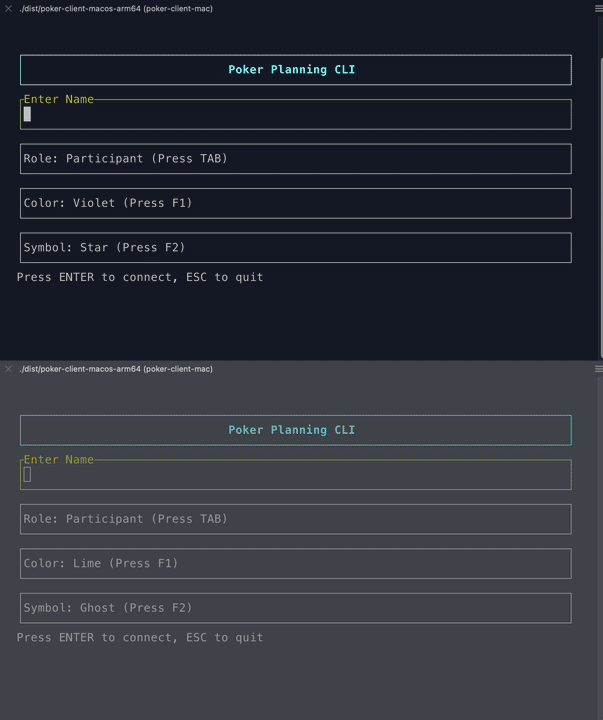

# Poker Planning CLI



A terminal-based Poker Planning tool for agile teams, featuring a real-time TUI client and server.

## Installation & Connection

To join a session, you need to connect to the game server and run the client.

### 1. Connect to Server (AWS SSM)
You must forward the server port (8888) to your local machine using AWS Systems Manager.
Run the following command in a terminal (keep it open):

```bash
aws ssm start-session \
    --target i-0498121b79469ca5b \
    --document-name AWS-StartPortForwardingSessionToRemoteHost \
    --parameters '{"portNumber":["8888"],"localPortNumber":["8888"]}' \
    --region ap-southeast-1
```

*Note: Requires AWS CLI and Session Manager plugin.*

### 2. Install Client
You can download the latest client binary using the provided script:

```bash
./install.sh
```

Or manually:

```bash
curl -L -o client https://github.com/nicoalimin/poker-planning-cli/releases/download/v1.0.0/client
chmod +x client
```

### 3. Run
Once the port forwarding is active and the client is installed:

```bash
./client
```

## Features
- **Real-time Multiplayer**: See other players move and vote effectively instantly.
- **TUI Interface**: Fast, keyboard-centric interface (Arrow keys to move, Space to confirm).
- **Vote Privacy**: Votes are hidden until the Scrum Master reveals them.
